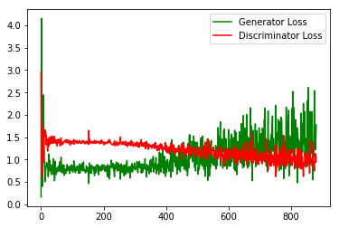

## Face Generation using Deep Convolutional Generative Adversarial Network

This project is part of Udacity DLND. It is a Deep Convelutional Generative Adversarial Network trained on the CelebA dataset to generate new faces. The network is tested on MNIST dataset to generate digits.

# A quick challenge:
### Can you tell that which image contains real human faces and which contains 'fake' faces generated by GAN?

<table style="width:100%">
  <tr>
    <th>
      

           
            Faces 1
      

    </th>
    <th>
      

           
            Faces 2
      

    </th>
  </tr>

## Architecture

The architecture of DC-GAN contains a **generator** and a **discriminator**.

The generator used in the [original paper](https://arxiv.org/pdf/1511.06434.pdf):

I have reduced the number of units in the generator and reduced the number of layers for discriminator. I was still able to generate quite clear faces. So, if you got more computation power, you should try to make the network deeper to get better result.

Training loss of the network:

## MNIST
I only trained it for 2 epochs. You should get better result if train it longer.

## CelebA
Trained after 7 epochs.

